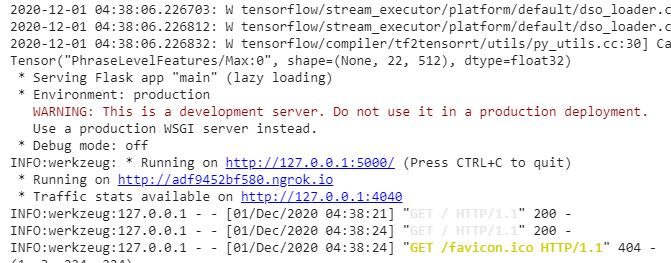
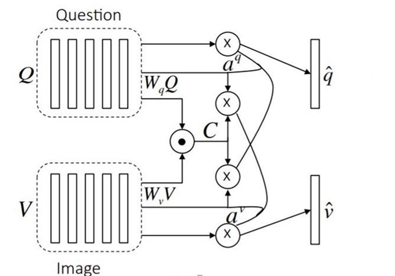
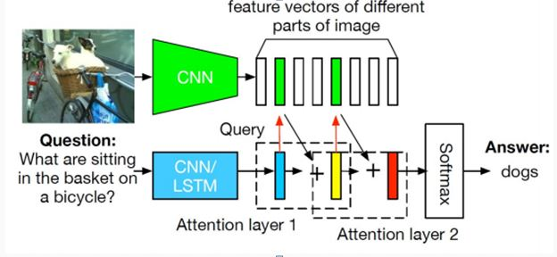

  # Visual Question Answering


> The system we propose can answer to questions like the ones shown in the picture.

### Team Members

- [Ram Gunasekaran A 18BCE1234](#ram)
- [Siddharth M Nair 18BCE1238](#sid)
- [C K M Ganesan 18BCE1266](#ckm)

### Table of Contents

- [Introduction](#introduction)
- [Scope](#scope)
- [Dataset](#dataset)
- [Demo](#demo)
- [Deploying in your machine](#deploy)
- [Models Proposed](#models-proposed)
- [Results](#results)
- [Conclusion and Future Work](#future-work)


## Introduction

Visual Question Answering is a research area about building an AI system to answer questions presented in a natural language about an image. A system that solves this task demonstrates a more general understanding of images: it must be able to answer completely different questions about an image, oftentimes even addressing different sections of the image.
Consider the example,For the image, our AI system should be able to localize the subject being referenced to in the question and detect it and should have some common-sense knowledge to answer it.


## Scope 

When a image is loaded to the system and a corresponding question is given in natural language the system we built will be able to localize the part of the image for which the question is relevant and find its answer. We were able to build this system for a given set of training and validation sets.The built system will be able to understand questions in English language but not in any other languages. It is assumed that for a given image the user will only ask questions relevant to the image if some random question is asked the system will not be able to identify that it’s a wrong question and will answer something in random.

## Dataset

The dataset can be downloaded from the link https://visualqa.org/download.html

## Demo

Click on the image to watch the demo

[](http://www.youtube.com/watch?v=R_bW280eoJM "VQA_Demo")

## Deploying in your machine

Follow the steps to make deploy it locally

- Download the repository and push it on to your google drive
- Open a google Colab notebook with GPU runtime
- Mount your Google drive to the Colab notebook
- Change Directory to the project folder
- Install the requirements using the command   
```html
    pip install -r requirements.txt
```
- Run the main file using the following command 
```html
    !python VQA_main.py
```
After executing all the above commands you should get output like this



Follow the running on link to check the output

## Models Proposed

Two models namely Parallel Co-Attention and Alternating Co-Attention Model are proposed in this project

### Parallel Co-Attention Model


The question and image will be processed in parallel and the answer for the given set of image and question is a result parallelized execution of the model.

### Alternating Co-Attention Model


1.	Iterate the above query-attention process using multiple attention layers 
2.	Extracts more fine-grained visual attention information for answer prediction

## Results

|Model|Accuracy|
|:---------:|:---------:|
|Baseline|57%|
|Alternating Co-Attention|60%|
|Parallel Co-Attention|63%|

Out of the three models implemented Parallel Co-Attention model is found to give better results thereby clearly proving giving equal emphasis to question as well as the image is important.We were able to achieve a accuracy 63% using  Parallel Co-Attention which can be further increased by increasing the number of epochs and a better dataset.  

## Conclusion and Future Work

1.	The alternating co-attention and the parallel co-attention were implemeted using LSTM .
2.	Among the three models(including baseline) parallel co-attention is found to be more accurate and is found to give better results than the others.
3.	The  final accuracy of the built model  is 63%.

The accuracy can be still improved by increasing the number of epochs and training with morea and better datasets.

In the future with better datasets and increased training the better accuracy can be achieved. The model can then be used to build a Visual Assistance for Blind People. For example a blind person can take a picture and ask a question like “What is there in this Picture” which can be converted to text using the Speech to Text API and the corresponding answer will be sent back to the user using Text to Speech API,acting as visual support for them.
